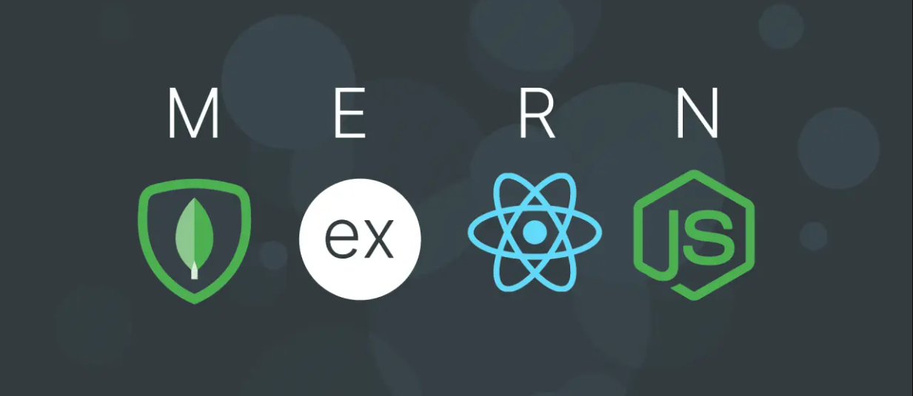
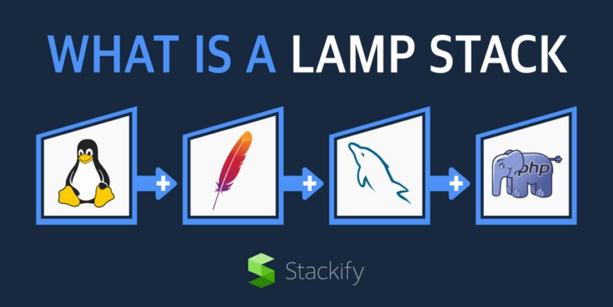

Se imagine olhando para um super carro de luxo, uma Lamborghini, por exemplo. O design é lindo, a cor é deslumbrante, os detalhes internos hipnotizam a cada segundo que você olha. Você tem permissão para entrar e girar a chave. Acelera e o motor ronca forte e alto; pelo volante você sente cada cavalo de força e, a cada segundo, a adrenalina parece mais absurda. 

***Quem é capaz de pensar em tantos detalhes e na harmonia de cada peça?
Quem são os reponsáveis por criar uma máquina tão poderosa e elegante?
Que poderes e conhecimentos essas pessoas podem ter para fazer essa obra-prima?***

Antes de te responder, pense como seria feito um software com essas caracteristicas... 

A seguir, conheça a equipe capaz de tão grande feito.

Este carro é como um software bem projetado. Os designers, profissionais do Frontend, elaboram cada detalhe para agradar, encantar e satisfazer as necessidades do usuário. Eles usam HTML, CSS e JavaScript para criar uma interface que é não apenas bonita, mas também intuitiva e responsiva. Imagine-os ajustando cada botão, animação e layout, garantindo que o usuário se sinta em casa ao usar a aplicação. Cada clique, cada movimento é cuidadosamente planejado para oferecer a melhor experiência possível.

Já o motor é projetado pelos engenheiros, profissionais do Backend, que constroem os mecanismos para atender a cada necessidade: segurança, durabilidade, resistência e tudo necessário para que a experiência do usuário seja única e satisfatória. Eles trabalham com servidores, bancos de dados e APIs, usando linguagens como Java, Python e Node.js. Sua responsabilidade é garantir que tudo funcione perfeitamente, desde o login do usuário até a recuperação de dados em tempo real. Eles criam a lógica e as estruturas que suportam a aplicação, como os engenheiros que garantem que o motor da Lamborghini funcione sem problemas.

Os desenvolvedores Fullstack são os verdadeiros canivetes suíços do desenvolvimento de software. Eles dominam tanto o Frontend quanto o Backend, capazes de construir uma aplicação completa do zero. Esses profissionais podem projetar uma interface atraente e, ao mesmo tempo, desenvolver a lógica que a sustenta. No mercado, é comum encontrar Fullstacks trabalhando em startups, onde a versatilidade é essencial, ou liderando equipes em grandes empresas, onde sua visão holística ajuda a integrar diferentes partes de um projeto. Eles usam frameworks como React, Angular no Frontend e Express, Django no Backend, sendo capazes de alternar entre as duas áreas conforme necessário.

## Modelos de Fullstack Comuns no Mercado

* MEAN Stack (MongoDB, Express.js, Angular, Node.js): Ideal para desenvolver aplicações JavaScript de ponta a ponta.

* MERN Stack (MongoDB, Express.js, React, Node.js): Semelhante ao MEAN, mas utiliza React para o Frontend, oferecendo uma experiência de usuário mais dinâmica.

* LAMP Stack (Linux, Apache, MySQL, PHP): Um clássico que continua popular para desenvolver aplicações web robustas e escaláveis.

Pode parecer complexo, mas se você tem um super poder, seja ele com algorítimos, lógicas de processamentos de dados ou uma visão apurada para interfaces, comportamentos de elementos gráficos ou atenção à detalhes que cativam pessoas, você tem lugar nesse super time que faz o dia de milhões de pessoas melhor!

Este artigo foi gerado por IA e revisado por uma pessoa 100% humana. Conecte-se comigo pelo Linkedin e junte-se à equipe DEV mais poderosa de todas!

[ Vinicius Prado](https://www.linkedin.com/in/profissionalvinicius/)

Fontes de produção:

* Imagens geradas por: [Copilot](https://copilot.microsoft.com/)
* Edição de imagens: [Microsoft Designer](https://designer.microsoft.com/)
* Conteúdo gerado por: [ChatGPT](https://chatgpt.com/)